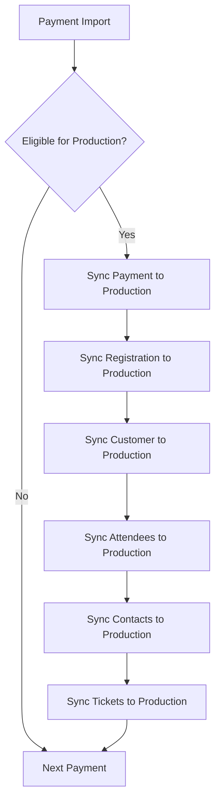

# Immediate Sync Architecture

## 🎯 Overview

The Enhanced Payment Sync now processes each payment **completely** through both import and production phases before moving to the next payment. This ensures all relationships exist in production for validation when processing subsequent payments.

## 🔄 Processing Flow

### Per-Payment Processing

For **EACH** payment:

```
Phase 1 - Import to import_* collections:
  1. Import payment → import_payments
  2. Import registration → import_registrations  
  3. Import bookingContact → import_customers
  4. Import attendees → import_attendees
  5. Import contacts (including bookingContact) → import_contacts
  6. Process packages
  7. Import tickets → import_tickets

Phase 2 - If eligible for production, sync to production:
  8. Check if payment is eligible (_shouldMoveToProduction)
  9. Sync payment → payments
  10. Sync registration → registrations
  11. Sync customer → customers
  12. Sync attendees → attendees
  13. Sync contacts → contacts
  14. Sync tickets → tickets

✅ COMPLETE this payment
→ Move to NEXT payment
```

## 🔒 Benefits

### 1. **No Orphaned Tickets**
- Tickets are **always** synced with their complete dependency chain
- Registration, attendees, and customers exist in production before tickets

### 2. **Valid Relationships**
- Each payment can validate against previously synced data
- No validation failures due to missing production data

### 3. **Incremental Progress**
- Each payment is fully processed before moving on
- Partial sync still leaves data in a consistent state

### 4. **Better Error Recovery**
- If sync fails, can resume from the last successfully processed payment
- No need to re-sync everything

## 📊 Validation Flow



## 🔧 Implementation Details

### Key Methods

1. **`syncPaymentToProduction(paymentId, registrationId, db)`**
   - Syncs complete data chain for one payment
   - Called immediately after import phase completes
   - Handles all related entities in correct order

2. **`syncDocumentToProduction(importDoc, mapping, db)`**
   - Syncs individual document to production
   - Checks if already synced (idempotent)
   - Updates or creates as needed

### Processing Order

1. **Payment** - Financial record
2. **Registration** - Event registration
3. **Customer** - From booking contact
4. **Attendees** - Event participants
5. **Contacts** - Unified contact records
6. **Tickets** - Last, after all dependencies

## 📝 Logging

The sync provides detailed logging for each payment:

```
📝 Processing Square payment: F6oCqaqnzPwfTGdhPYIZIBucz3HZY
  ✓ Imported to import_payments
  ✓ Found registration: 2f4c440f-542c-4608-9974-186aef3eb8a1
  ✓ Imported FULL registration to import_registrations
  ✓ Created new customer: Robert Drake
  ✓ Found 2 attendee(s)
  ✓ Found 4 ticket(s) in registration
  ✅ Completed processing Square payment
  🔄 Syncing payment data to production...
    ✓ Payment synced to production
    ✓ Registration synced to production
    ✓ Customer synced to production
    ✓ Attendee 1 synced to production
    ✓ Attendee 2 synced to production
    ✓ Contact synced to production
    ✓ Ticket 1 synced to production
    ✓ Ticket 2 synced to production
    ✓ Ticket 3 synced to production
    ✓ Ticket 4 synced to production
  ✅ Payment data synced to production
```

## 🚀 Running the Sync

```bash
# Run the enhanced sync with immediate production sync
npm run sync

# Monitor progress
npx tsx scripts/test-immediate-sync.ts

# Watch progress continuously
npx tsx scripts/test-immediate-sync.ts --watch
```

## ✅ Success Criteria

1. **All import_* collections populated** with payment data
2. **Production collections populated** incrementally as each payment completes
3. **No orphaned tickets** - all tickets have valid registrations
4. **Validation passes** - all relationships properly maintained
5. **814 tickets** successfully reach production (your specific case)

## 🔍 Troubleshooting

### If tickets aren't syncing:

1. **Check eligibility**: Ensure `_shouldMoveToProduction` is not false
2. **Check payment status**: Only COMPLETED payments sync to production
3. **Check registration**: Tickets need valid registration references
4. **Check logs**: Look for specific error messages in sync logs

### If validation fails:

1. **Check field paths**: Ensure queries use correct field names
2. **Check relationships**: Verify foreign key references are correct
3. **Check production data**: Ensure dependencies synced successfully

## 📈 Monitoring

Use the monitoring script to track progress:

```bash
npx tsx scripts/test-immediate-sync.ts
```

This shows:
- Import collection counts
- Production collection counts  
- Sync progress percentages
- Orphaned ticket detection
- Overall sync health

## 🎯 Result

With immediate sync architecture, the system:
- ✅ Processes each payment completely before moving to the next
- ✅ Maintains all relationships properly
- ✅ Prevents orphaned tickets
- ✅ Provides better error recovery
- ✅ Enables incremental progress tracking