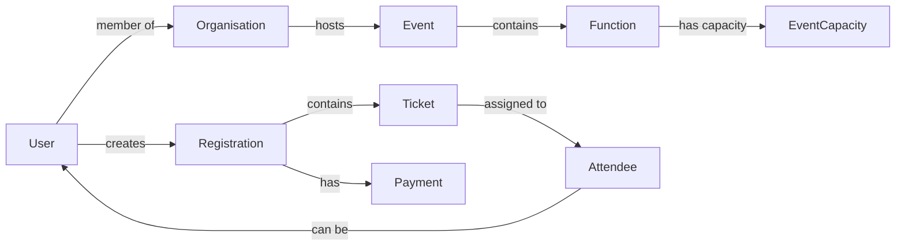

# LodgeTix Clean Database Schema

This documentation outlines the planned database schema for the cleaned LodgeTix production database.

## Overview

The database uses MongoDB with a single database containing multiple collections. This design supports ACID transactions for critical operations like ticket purchases.

## Database Name
`lodgetix_production`

## Collection Categories

### 1. Event Management
- [events](./collections/events/README.md) - Master event records
- [functions](./collections/functions/README.md) - Individual functions within events
- [venues](./collections/venues/README.md) - Venue information
- [event_capacity](./collections/event_capacity/README.md) - Real-time capacity tracking

### 2. Ticketing & Registrations
- [registrations](./collections/registrations/README.md) - Purchase records
- [tickets](./collections/tickets/README.md) - Individual ticket records
- [attendees](./collections/attendees/README.md) - People attending (ticket holders)
- [ticket_transfers](./collections/ticket_transfers/README.md) - Transfer history

### 3. Financial
- [payments](./collections/payments/README.md) - Payment records
- [transactions](./collections/transactions/README.md) - Financial transactions
- [refunds](./collections/refunds/README.md) - Refund records
- [payment_methods](./collections/payment_methods/README.md) - Stored payment methods

### 4. Users & Organisations
- [users](./collections/users/README.md) - All system users
- [organisations](./collections/organisations/README.md) - Lodges, grand lodges, etc.
- [organisation_members](./collections/organisation_members/README.md) - User-organisation relationships
- [contacts](./collections/contacts/README.md) - Contact information
- [roles](./collections/roles/README.md) - Permission roles

## Design Principles

1. **Single Database**: All collections in one database to support transactions
2. **Referential Integrity**: Clear relationships between documents
3. **Audit Trail**: Track all changes with timestamps and user IDs
4. **Scalability**: Designed for growth with proper indexes
5. **Data Consistency**: ACID transactions for critical operations

## Key Relationships

## Migration Strategy

See [Migration Plan](./migration-plan.md) for details on how to migrate from the existing messy database to this clean schema.